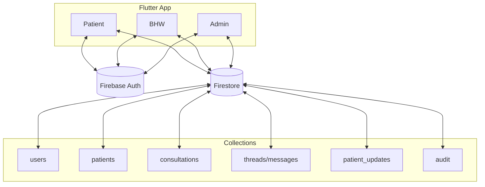
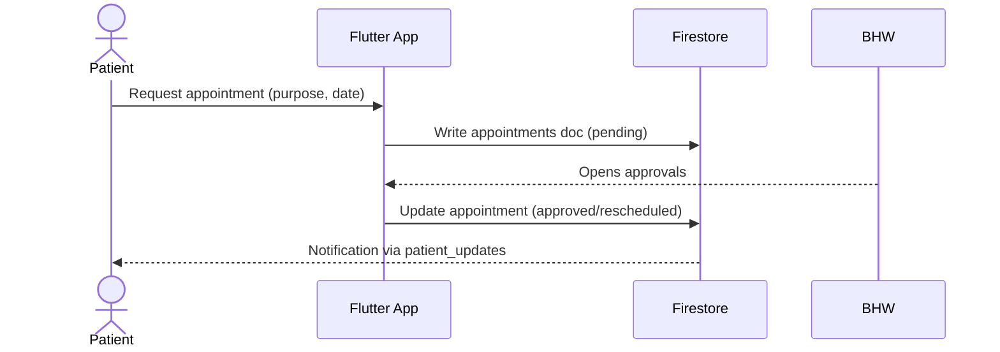

# CHRMS – Community Health Record Management System

Centralized digital health platform connecting Patients, Barangay Health Workers (BHWs), and Admins. Built with Flutter + Firebase.

## Overview

- Streamlines record-keeping and appointments
- Supports programs: Immunization, Maternal & Child, Nutrition, Disease Control, Sanitation
- Improves data quality, reporting, and decision-making

## Roles & Capabilities

- Admin
  - Dashboard overview
  - User Management (add/update/deactivate)
  - Consultations & Patient Records oversight
  - Reports (range + program filters; CSV/PDF export)
  - Notifications broadcast
  - Audit Trail (live filters + CSV export)
  - System Backup (export/import)
- Health Worker (BHW)
  - Dashboard of daily activities
  - Patient data entry & updates
  - Consultation records
  - Appointment approvals/reschedules
  - Program modules (Immunization, Maternal & Child, Nutrition, Disease Control, Sanitation)
  - Messaging with patients
- Patient
  - Dashboard with upcoming appointments
  - Notifications & health tips
  - Request appointments

## System Flow

1. Patient requests appointment (select purpose, e.g., BP check or immunization)
2. BHW reviews and confirms/reschedules
3. Patient receives status via Notifications
4. BHW conducts consultation and records data
5. Admin monitors data and generates reports
6. Backup and Audit logs ensure integrity and accountability

## Architecture (high-level)



## Appointment Sequence



## Data Model (key collections)

- users: { id, name, role, email, ... }
- patients: { id, name, age, sex, diagnosis, createdAt, ... }
- consultations: { id, patientId, notes, status, createdAt, endedAt, ... }
- threads: { id, title, participants[], lastMessage, archived, updatedAt }
  - messages (subcollection): { id, senderId, text, flagged, flags[], createdAt }
- patient_updates (notifications): { id, recipientId, message, read, archived, createdAt }
- audit: { id, actorId, actorRole, action, target?, details?, level, at }

## Security Rules (summary)

- users: user can read/write own doc
- patients, consultations, program modules: authenticated; HW/Admin elevated rights
- threads/messages: participants & HW/Admin can read/write; supports archived/flagging
- patient_updates: recipient or HW/Admin can read; recipient can update read/archived; admin can delete
- audit: HW/Admin can create; admin-only read; update/delete restricted to allowed admin

See firestore.rules for specifics.

## Indexes (summary)

- threads: participants + updatedAt, participants + archived + updatedAt
- consultations: status + createdAt, status + endedAt
- patient_records: patientId + createdAt
- (Optional for audit filters): level + at, actorId + at, action + at

Edit firestore.indexes.json and deploy.

## Setup & Run

Prereqs: Flutter SDK, Firebase project configured.

1) Install dependencies
```
flutter pub get
```

2) Run app
```
flutter run
```

3) Deploy Firestore rules & indexes
```
firebase deploy --only "firestore:rules,firestore:indexes" --project <YOUR_PROJECT_ID>
```

## Reports

- Navigate to Reports
- Select range (day/week/month) and program filters
- Export filtered report as PDF or CSV

## Backup & Restore

- Backup (System Backup screen)
  - Select collections
  - Optional date range
  - Export JSON (single file) or CSV (per collection)
- Restore (Import JSON)
  - Paste JSON array of documents with `id`
  - Dry-run preview (valid/invalid)
  - Import executes batched writes (merge, non-destructive)

## Audit Trail

- Live stream with filters: level, actorId, action, date range
- Export CSV for the filtered set

## Contributing

- Use meaningful commit messages and test critical flows (appointments, notifications, backups)
- Keep rules and indexes in sync with new queries and features
